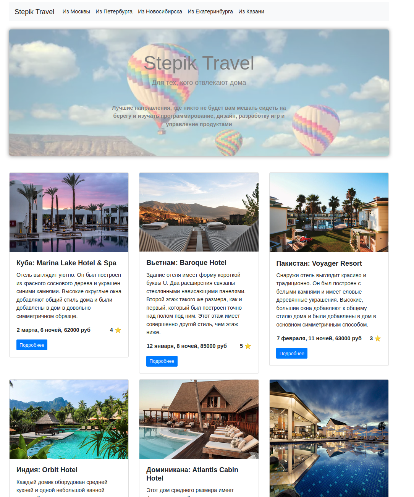
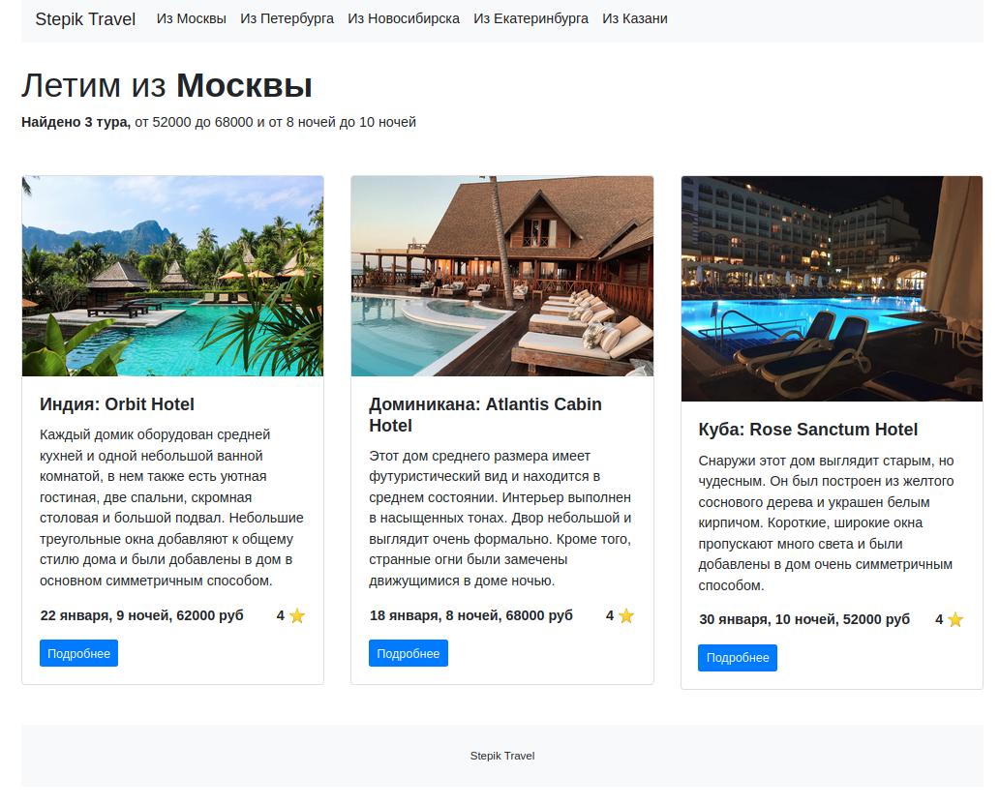
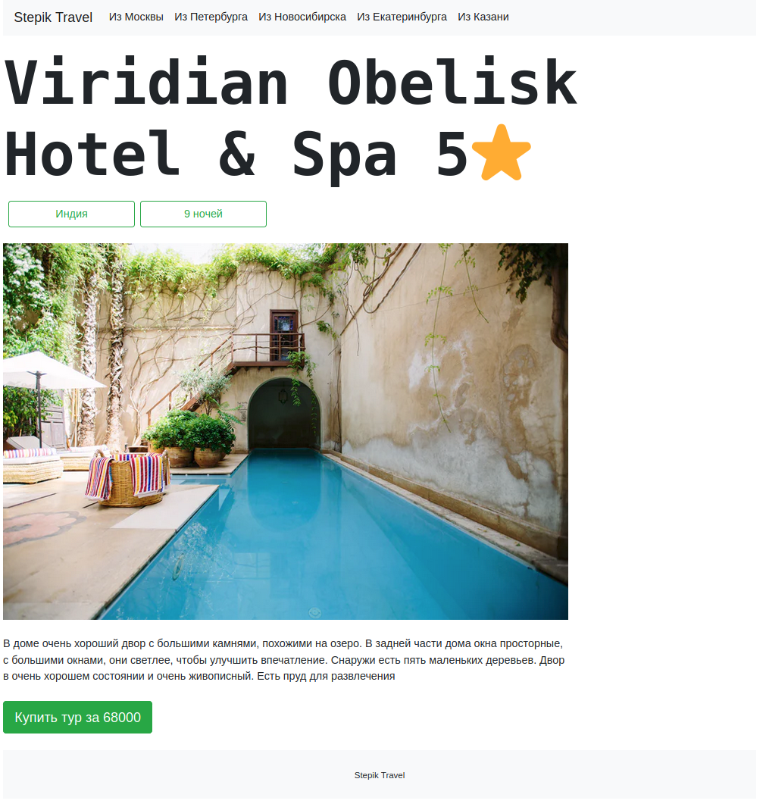

# Сайт с путешествиями

Простой веб-сайт, реализованный на Flask, имеющий три странички.


* ## Главная

* ## Направление 

* ## Тур


## Как запустить

Установить зависимости
```bash
pip install -r requirements.txt
```
Запустить
```bash
python app.py
```


